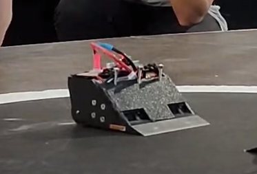
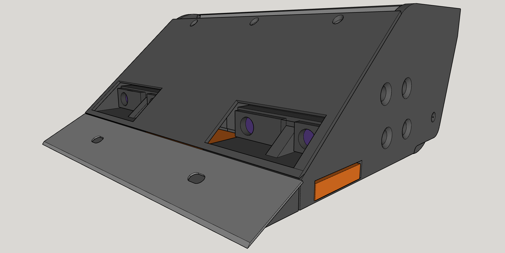

# JimbeiBot

Robot minisumo con ESP32 C3 super mini, motores Brushless de medio caballo de poder y sensores SHARP.

## Hardware
- ESP32 C3 super mini
- 2x ESC BlHeli 20A
- 2x Motores Brushless de alto torque 2216
- 4 Leds
- LiPo 2S ~2000 mAh
- 4x Sensores SHARP GP2Y0E03 
- Goma de ruedas hecha a medida con Uretano/Vitaflex20
- Chasis completamente impreso en PLA
- Pletina de cobre para aumentar peso

## Software
- Programado con Visual Estudio Code con Arduino
- Disponible programa básico de minisumo con PID
